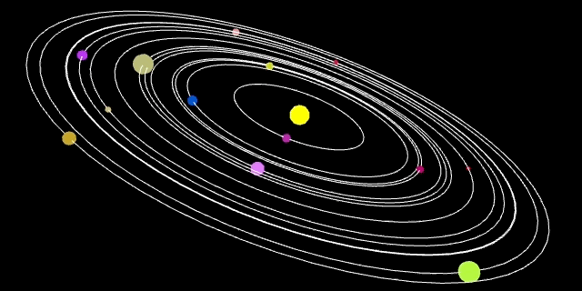

# SolarSystem-Graph



Solar System that uses planets as values for a bar graph of sorts

# Usage

To use the graph simply install the package with npm.

```shell
npm install --save solarsystem-graph
```

Import the library into your project and setup the solar system graph by providing it a list of planetary like objects.

```javascript
import SolarSystemGraph from 'solarsystem-graph'

SolarSystemGraph(document.getElementById('solarsystem-graph'), [
    { 
        id: 2,
        importance: Math.random(),
        scale: Math.random(),
        onHover: function() {
            document.getElementById('header').innerHTML = 'The Secret Life of Bees';
        },
        onClick: function() {
            document.getElementById('header').innerHTML = 'Loading The Secret Life of Bees';
        }
    },
    { 
        id: 3,
        importance: Math.random(),
        scale: Math.random(),
        onHover: function() {
            document.getElementById('header').innerHTML = 'Das Buch der Bilder';
        },
        onClick: function() {
            document.getElementById('header').innerHTML = 'Loading Das Buch der Bilder';
        }
    },
    { 
        id: 4,
        importance: Math.random(),
        scale: Math.random(),
        onHover: function() {
            document.getElementById('header').innerHTML = 'Das Knaben Wunderhorn';
        },
        onClick: function() {
            document.getElementById('header').innerHTML = 'Loading Das Knaben Wunderhorn';
        }
    }
    ...
])
```

The planetary like objects contain several bits of information, the id of the planet, its level of importance and scale, an onHover function, and an onClick function. The importance reflects the distance of the planet from the sun. The scale represents the size of the planet.